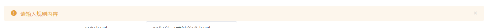

# 综测管理系统文档

## 问题定义

综测管理系统是指学校或机构为了对学生进行全面评价和管理而建立的一套系统，包括学生档案、综合素质评价、学业成绩、课外活动等方面的信息。但是，在实际应用中，综测管理系统存在以下问题：

1. 数据不准确：由于数据来源多样化，数据的准确性难以保证，例如学生在课外活动中的参与情况难以统计，导致评价结果不够客观。
2. 评价标准不统一：不同的学校或机构对于综合素质评价的标准不同，导致评价结果的可比性差，难以进行横向比较。
3. 评价结果过于简单化：综测管理系统往往只给出一个综合评分，无法反映学生在不同方面的优劣，也无法提供针对性的帮助。
4. 学生参与度低：由于学生对于综测管理系统的认可度不高，很多学生对于综合素质评价的参与度较低，导致评价结果的可靠性不足。
5. 数据保密性问题：综测管理系统中包含大量的个人信息，如何保护学生的隐私成为一个重要的问题。

## 可行性研究

为了解决综测管理系统存在的问题，需要进行可行性研究，确定系统建设的可行性和实施方案。具体可行性研究内容如下：

1. 技术可行性：通过对现有技术进行分析，确定综测管理系统的技术实现方案和所需技术支持，包括系统架构、数据库、编程语言等。
2. 经济可行性：对系统建设和运营的预算进行估算，考虑到硬件、软件、人力、培训等成本，确定系统建设和运营的经济可行性。
3. 社会可行性：考虑到综测管理系统对于学生、家长、教师和学校的影响，进行社会可行性研究，包括系统建设的必要性、可接受性和可推广性等。
4. 法律可行性：对于综测管理系统中包含的个人信息和数据保护问题，进行法律可行性研究，确保系统建设和运营符合相关法律法规。
5. 运营可行性：对于综测管理系统的运营模式进行研究，包括系统维护、数据管理、用户支持等方面，确保系统的可持续运营。

综合以上可行性研究结果，制定出系统建设和运营的详细实施方案，包括系统架构、功能设计、数据管理、用户培训等方面，确保系统建设的顺利进行和运营的稳定。

## 需求分析

为了解决综测管理系统存在的问题，需要建立一套学生综测管理系统，满足以下需求：

1. 数据准确性需求：系统应该具有数据采集、处理和分析的能力，能够对学生的各项综合素质进行准确评价和管理。
2. 评价标准统一性需求：系统应该制定统一的评价标准，确保评价结果的可比性和横向比较的可行性。
3. 评价结果多样化需求：系统应该提供多样化的评价结果，反映学生在不同方面的优劣，提供针对性的帮助。
4. 学生参与度提高需求：系统应该具有良好的用户体验和易用性，能够提高学生对于综合素质评价的认可度和参与度，确保评价结果的可靠性。
5. 数据保密性需求：系统应该具有严格的数据保护措施，确保学生个人信息的安全和隐私。

系统应该包括以下功能：

1. 学生档案管理：记录学生的基本信息、学业成绩、课外活动等信息。
2. 综合素质评价：制定统一的评价标准，对学生的各项综合素质进行评价和管理。
3. 评价结果展示：提供多样化的评价结果，反映学生在不同方面的优劣，提供针对性的帮助。
4. 用户体验优化：具有良好的用户界面和易用性，提高学生对于综合素质评价的认可度和参与度。
5. 数据安全保护：具有严格的数据保护措施，确保学生个人信息的安全和隐私。

系统应该满足以下要求：

1. 技术要求：系统应该具有稳定、可靠、高效的技术支持，包括系统架构、数据库、编程语言等。
2. 经济要求：系统建设和运营的预算应该合理，考虑到硬件、软件、人力、培训等成本，确保经济可行性。
3. 社会要求：系统建设的必要性、可接受性和可推广性应该得到社会认可。
4. 法律要求：系统建设和运营应该符合相关法律法规，保护学生个人信息和数据安全。
5. 运营要求：系统应该具有可持续运营的能力，包括系统维护、数据管理、用户支持等方面。

## 总体设计

### 普通学生

1. 登录系统
2. 上传综测证明文件
3. 查看自己的综测审核进度
4. 查看自己的综测排名

### 带管理员权限的学生

1. 登录管理系统
2. 审核综测证明文件
3. 分配权限给其他成员

### 辅导员权限

1. 登录管理系统
2. 创建权限组（角色）
3. 查看审核结果

## 详细设计

### 数据库设计

> 名称使用小驼峰命名方式和 java 实体使用相同的命名方式，减少映射这一步

#### user表

属性名 | 数据类型    | 备注                                                   
---- | --- |---- 
userID | int | 用户id，user表唯一 
account | char(12) | 用户学号/工号 
password | char(64) | 登录密码（md5加密） 
college | varchar(50) | 所属学院 
theClass | varchar(50) | 所属班级 
counselor | char(12) | 辅导员对应account 
isAdmin | int | 该用户的权限，默认置零，辅导员为7777，班长为2，班委为1 
isDelete | tinyint | 软删除 0不删除，1删除 

#### score表

| 属性名              | 数据类型 | 备注                     |
| ------------------- | -------- | ------------------------ |
| scoreID             | int      | 综测分id，score表唯一    |
| account             | char(12) | 用户学号/工号            |
| ideologicalAndMoral | double   | 思想品德综合分           |
| courseLearning      | double   | 课程学习成绩综合分       |
| bodyArtIntegrated   | double   | 体艺综合分               |
| practiceAbility     | double   | 创新创业与实践能力综合分 |
| totalScore          | double   | 总分                     |
| isDelete            | tinyint  | 软删除 0不删除，1删除    |

#### rules表	

| 属性名   | 数据类型 | 备注                         |
| -------- | -------- | ---------------------------- |
| rulesID  | int      | 规则id，rules表唯一          |
| groupID  | int      | 所属父级规则id               |
| content  | text     | 具体综测条例                 |
| addScore | tinyint  | 是否为加分选项 0 加分 1 减分 |
| maxScore | double   | 该规则最大加分减分项         |
| belong   | char(12) | 谁创建的该条细则             |
| isDelete | tinyint  | 软删除 0不删除，1删除        |

#### audit表

| 属性名   | 数据类型 | 备注                                         |
| -------- | -------- | -------------------------------------------- |
| auditID  | int      | 审核材料id，audit表唯一                      |
| rulesID  | int      | 综测材料所属的综测规则id                     |
| file     | text     | 文件所在的路径                               |
| score    | tinyint  | 本条材料最终的分值                           |
| belong   | double   | 所属人员的id                                 |
| status   | char(12) | 材料审核的状态，0 待审核，1已通过， 2 已打回 |
| isDelete | tinyint  | 软删除 0不删除，1删除                        |

#### group表

| 属性名     | 数据类型 | 备注                  |
| ---------- | -------- | --------------------- |
| groupID    | int      | 综测分id，score表唯一 |
| belong     | char(12) | 用户学号/工号         |
| proportion | double   | 思想品德综合分        |
| groupName  | double   | 课程学习成绩综合分    |
| isDelete   | tinyint  | 软删除 0不删除，1删除 |

groupID                  int                       --分组id

belong                  char(12)				--谁创建的

proportion          double					--分组占比

isDelete			    tinyint     			  -- 软删除 0不删除，1删除

groupName        varchar(225)         --分组名称

### 接口设计

> 后端ErrorCode：自定义编码，前端可通过后端传过来的编码在前端做响应
>
> SUCCESS(0, "ok"),
> PARAMS_ERROR(40000, "请求参数错误"),
> LOGIN_ERROR(40001,"用户不存在或账户密码错误"),
> REGISTER_ERROT(40002,"用户已存在请登录"),
> PASSWORD_ERROT(40003,"密码错误"),
>
> PROPORTION_ERROT(40004,"数据不在合理范围内"),
>
> ADMIN_ERROT(40005,"已是管理员")
> 
> NOT_LOGIN_ERROR(40100, "未登录"),
> NO_AUTH_ERROR(40101, "无权限"),
> NOT_FOUND_ERROR(40400, "请求数据不存在"),
> FORBIDDEN_ERROR(40300, "禁止访问"),
>SYSTEM_ERROR(50000, "系统内部异常"),
> OPERATION_ERROR(50001, "操作失败");
>
> 
>

UserController:

1. /user/login

   功能：通过学号/工号account,密码password登录系统

   参数：

   String account,

    String password

   返回：如果用户不存在或者密码错误，返回错误码LOGIN_ERROR

   ​			如果用户存在且密码正确，code返回0

2. /user/register

   功能：用户注册

   参数：

    String account

    String password

    String college

    String theClass

    String checkPassword 

   返回：如果用户已存在，返回错误码REGISTER_ERROT

   ​			如果信息填写不全或两次密码不一致，返回错误码PARAMS_ERROR

   ​			正确注册，code返回0

3. /user/current

   功能：获取当前session对应的用户

   返回：如果code == 200，则为普通用户（前端可以重新校验）

   ​			如果code == 300  为拥有管理员权限的用户

4. /user/logout

   功能：退出系统

5. /user/changPassword

   功能：通过userID修改用户密码

   参数：

    Integer userID

    String oldPassword

    String newPassword

    String checkPassword

   返回：如果旧密码输入不对，返回错误码PASSWORD_ERROT

   ​			如果两次新密码不一致，返回错误码PARAMS_ERROR

   ​			如果修改成功，返回成功码SUCCESS

6. /user/findUser

   功能：通过account查看用户信息

   参数：String account

   返回：如果用户不存在，返回错误码PARAMS_ERROR

   ​			如果用户存在，返回code:0;data:ReUser;message:"ok"

   

7. /user/findUserIsAdmin

   功能：查看所有学生管理员（班委）的信息

   返回：如果用户不存在，返回错误码NOT_FOUND_ERROR

   ​			如果用户存在，返回code:0;data:reUserList;message:"ok"

   

8. /user/findUserAdmin

   功能：查看所有学生管理员（班长）的信息

   返回：如果用户不存在，返回错误码NOT_FOUND_ERROR

   ​			如果用户存在，返回code:0;data:reUserList;message:"ok"

9. /user/deleteUserAdmin

   功能：撤销学生管理员的权限

   参数：String account

   返回：如果撤销失败，返回错误码SYSTEM_ERROR

   ​			如果撤销成功，返回code:0;data:reUserList;message:"ok"

10. /user/fixAdminToAdmin

   功能：辅导员给班长授权

   参数：String account

   返回：如果已经是管理员，返回错误码ADMIN_ERROT

   ​			如果授权不成功，返回错误码SYSTEM_ERROR

   ​			如果授权成功，返回正确码SUCCESS

11. /user/fixAdminToUser

    功能：班长给班委授权

    参数：String account

    返回：如果已经是管理员，返回错误码ADMIN_ERROT

    ​			如果授权不成功，返回错误码SYSTEM_ERROR

    ​			如果授权成功，返回正确码SUCCESS

AuditController:

1. /audit/add

   功能：学生上传综测材料信息

   参数：

   String belong

   Integer status

   Integer rulesID

   String file

   返回：如果上传不成功，返回错误码PARAMS_ERROR

   ​			如果上传成功，返回code:0;data:reUserList;message:"ok"

2. /audit/delete

   功能：学生删除综测材料信息

   参数：

   Integer auditID

   返回：如果删除不成功，返回错误码PARAMS_ERROR

   ​           如果删除成功，返回正确码SUCCESS

3. /audit/find

   功能：查询某个学生上传的综测信息

   参数：

   String belong

   返回：如果没有这个学生的信息，返回错误码NOT_FOUND_ERROR

   ​           如果查询成功，返回code:0;data:reAuditList;message:"ok"

GroupController

1. /group/add

   功能：管理员上传规则分组信息

   参数：

   String belong

   Double proportion

   返回:如果占比之后超过1，返回错误码PROPORTION_ERROT

   ​         如果上传不成功，返回错误码SYSTEM_ERROR

   ​         如果上传成功，返回code:0,data:reGroup,message:"ok"

2. /group/delete

   功能：删除某条分组信息

   参数：

   Integer groupID

   返回：如果删除不成功，返回错误码SYSTEM_ERROR

   ​           如果删除成功，返回正确码SUCCESS

3. /group/fix

   功能：修改分组占比

   参数：

   Integer groupID

   Double proportion

   返回：如果修改分组占比之后超过1，返回错误码PROPORTION_ERROT

   ​           如果修改成功，返回code:0;data:reGroup;message:"ok"

4. /group/find

   功能：查找分组规则信息

   参数：

   Integer groupID

   返回：如果查找不成功，返回错误码NOT_FOUND_ERROR

   ​           如果查找成功，返回code:0;data:reGroup;message:"ok"

RulesController

1. /rules/add

   功能：添加规则信息

   参数：

   Integer groupID

   String content

   Integer addScore

   Double maxScore

   返回：如果添加不成功，返回错误码SYSTEM_ERROR

   ​           如果添加成功，返回code:0;data:reRules;message:"ok"

2. /rules/delete

   功能：删除规则信息

   参数：

   Integer rulesID

   返回：如果删除不成功，返回错误码SYSTEM_ERROR

   ​           如果删除成功，返回正确码SUCCESS

3. rules/fix

   功能：修改规则信息

   参数：

   Integer rulesID

   返回：如果修改不成功，返回错误码SYSTEM_ERROR

   ​           如果修改成功，返回code:0;data:reRules;message:"ok"

4. rules/find

   功能：查找规则信息

   参数：

   Integer rulesID

   返回：如果查找不成功，返回错误码SYSTEM_ERROR

   ​           如果查找成功，返回code:0;data:reRules;message:"ok"

5. rules/list

   功能：显示所有规则信息

   返回：如果查找不成功，返回错误码SYSTEM_ERROR

   ​           如果查找成功，返回code:0;data:reRulesLists;message:"ok"

ScoreController

1. /score/calculate

   功能：计算每个学生各个项成绩与总成绩

   参数：

   String account

   返回：code:0;data:result;message:"ok"

### 页面设计

#### 1.登录页面

1.登录页面

2.注册页面

3.登录成功/失败提示

（1）登录成功

（2）登录失败

4.注册成功/失败提示

（1）注册失败

​	a. 用户已存在时：

  b. 两次密码输入不一致时：

  c. 当没有选择学院或者班级时：

（2）注册成功

#### 2.学生端

1.默认页面

说明：进入系统后的欢迎页面。

2.个人中心页面

点击修改密码后

点击提交后

说明：显示基本个人信息，实现改密功能。

3.综测管理页面

说明：查看自己上传的综测材料以及审核进度，可以修改已上传的材料。

4.总分查看页面

说明：审核结束后查看自己的总分。

5.进入管理员端和退出系统

#### 3.管理员端

1.默认页面

说明：进入系统后的欢迎页面。

2.个人中心页面

点击修改密码后

说明：显示基本个人信息，实现和学生端一样的改密功能。

3.综测审核学生页面

点击打回按钮

点击打分按钮

学生管理员进入辅导员页面

说明：学生管理员可以给上传综测材料的学生打分。

4.综测审核辅导员页面

说明：辅导员可以查看所有学生综测材料的审核进度和综测材料。

5.权限管理学生页面

实现模糊搜索

点击确定按钮后

点击确定按钮后

如果已是管理员

点击移除按钮后

说明：本页面采用模糊搜索的方式，搜索数据库中已注册的学生学号来添加学生管理员，主要用于各班班长添加班委管理员，已成为管理员的会出现提示，成功被添加为管理员的学生会出现在权限组表格，显示学号，并可以随时删除，采用弹对话框的方式再次确定被添加或被删除学生的学号信息，避免误添加或误删。

6.权限管理辅导员页面

点击添加按钮后

实现模糊搜索

点击确定按钮后

点击确定按钮后

如果已是管理员

点击移除按钮后

说明：本页面采用模糊搜索的方式，搜索数据库中已注册的学生学号来添加学生管理员，用于辅导员添加各班班长。已经是管理员的学生会出现提示，成功添加成为学生管理员的班长会出现在权限组表格，显示学号，并可以随时删除，采用弹对话框的方式再次确定被添加或被删除学生的学号信息，避免误添加或误删。

7.规则录入页面

规则录入时的提示

学生管理员进入规则录入页面

8.进入学生端或退出系统

## 优势和不足

### 优势

1. 自动化管理：综测管理系统能够记录和计算学生的各项综合素质评价数据，省去了手动记录和计算的繁琐过程，提高了工作效率。
2. 数据集中管理：综测管理系统能够集中管理学生的各项综合素质评价数据，方便学校和教师进行数据查询、分析和统计，方便各班班委集中打分，提供了科学决策的依据和打分的速度。
3. 精确评估：综测管理系统能够根据学校设定的评分标准，对学生的各项综合素质进行精确评估，通过隐藏学号只显示综测材料文件的方式，减少了主观因素的干扰，提高了评估的准确性。
4. 个性化设置：综测管理系统可以根据学校的需求进行个性化设置，灵活定义各类综测项目和评分标准，满足不同学校的特色和要求。

### 不足

1. 数据安全性不足：综测管理系统中涉及到学生的个人信息和成绩等敏感数据，但有些系统在数据存储和传输过程中存在安全隐患，容易被黑客攻击或数据泄露。
2. 功能不完善：综测管理系统在功能设计上存在不足，无法满足学校的进一步需求，如还不能精准定位学生管理员权限和辅导员管理员权限，同时上传多个文件等。
3. 缺乏数据分析能力：综测管理系统缺乏对数据更进一步的深度分析和挖掘，分析算法还在不断完善中，不能为学校提供更有效的数据支持和决策参考。

## 总结

​		综测管理系统是一个用于管理学生综合测评的系统，它可以帮助学校对学生的各项能力进行评估和管理。本次web课设中，我们设计了一个简单的综测管理系统，实现了学生信息的录入、综测材料上传、管理员审核材料打分等功能。

​		在系统的设计过程中，我们首先进行了需求分析，明确了系统需要具备的功能和所需的数据。然后，我进行了系统的概要设计，确定了系统的基本结构和模块划分。接着，我进行了详细设计，确定了各个模块的功能和具体实现方式。最后，我进行了系统的编码和测试，确保系统能够正常运行。

​		在实际的开发过程中，我们遇到了一些困难和挑战。例如，学生信息的录入和查询功能需要与数据库进行交互，我们需要学习和掌握数据库的相关知识和技术。以及前后端连接的bug问题。此外，通过模糊查询来才找学生学号，我们需要去网上找相应的资料。

​		通过这次web课设，我们学到了很多关于系统设计和开发的知识和技能。我们了解了系统开发的整个流程，掌握了系统设计和编码的基本方法和技巧。同时，我们也提高了自己的问题解决能力和团队合作能力，通过与同学们的合作，我们共同完成了这个综测管理系统。我们相信这些经验和能力将对我的未来学习和工作有很大的帮助。

​		
